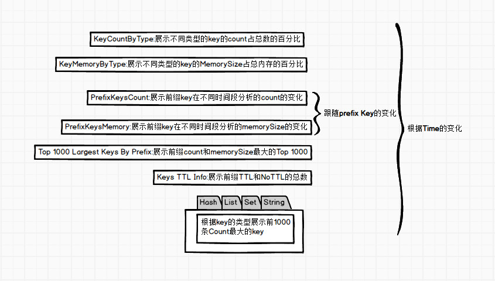

# Chart module introduction

Chart module is used for RCT to display the analysis results of RDB visually

In this module, the latest Redis data analysis results are displayed, and the results of 7 times of analysis are retained in time. By changing the time, you can switch to view the data reports analyzed at different times.

## 1.Key Count By Type
Statistical summary of the number of different types of data
## 2.Key Memory By Type
Different types of data memory bytes estimated statistical summary
## 3.Prefix Keys Count
Count the number of key prefixes according to the corresponding rule
## 4.Prefix Keys Memory
The memory byte information of the key prefix is counted according to the corresponding rule
## 5.Top 1000 Largest Keys By Perfix
Count the Top 1000 prefix key according to the prefix rule
## 6.Keys TTL Info
The prefixes tell you how much data is set to TTL or not set to TTL
## 7.Top 1000 Largest Keys By Type
According to different data structures, top Count and Bytes are the largest 1000 pieces of data