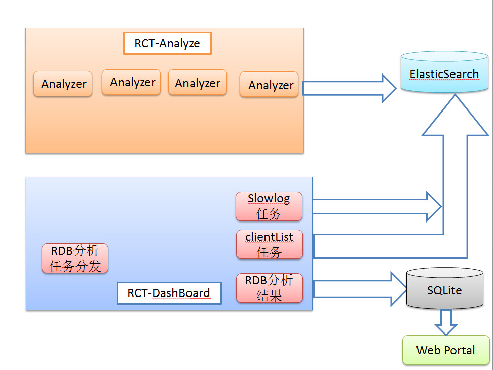

## 项目背景        
  Redis 是互联网产品开发中不可缺少的常备武器，它性能高、数据结构丰富、简单易用，但同时也是因为太容易用了，我们的开发同学不管什么数据、不管这数据有多大、不管数据有                多少通通塞进去，最后导致的问题就是 Redis 内存使用持续上升，但是又不知道里面的数据是不是有用，是否可以拆分和清理。为了更好地使用 Redis，除了对 Redis 做一些使用规                    范，还需要对线上使用的 Redis 有充分的了解。那么问题来了：一个 Redis 的实例用了那么大的内存，里边到底存了啥？都有哪些 key？每个 key 占用了多少空间？

 目前我们EC Bigdata team 运维公司 4个 Redis 集群，300+ Redis 实例，500G+ 的内存数据，我们想要分析业务是否有误用，以提高资源利用率。伴随着业务team的广泛使用，近期数据增                长比较快，我们紧迫需要一个工具分析一下各种业务存储的数据有多大，是否存入僵死数据浪费资源；同时E4 WWW redis 集群有业务方反馈近期有比较明显的慢查询发生，所以 我们需要针对 slow log 和存入的常用数据类型Hash,

List,Set分析，是否有big key引起慢查询,是否有team存在超大的 big key和不合理设置ttl的情况

那有没有什么办法让我们安全高效的看到 Redis 内存消耗的详细报表呢？办法总比问题多，有需求就有解决方案。EC Bigdata team针对这个问题实现了一个 Redis 数据可视化平台 RCT (Redis Computed Tomography)。

RCT可以非常方便的对 Reids 的内存进行分析，了解一个 Redis 实例里都有哪些 key，哪类 key 占用的空间是多少，最耗内存的 key 有哪些，占比如何，非常直观,除此之外，我们还可以针对Redis 慢查询进行分钟级别监控，直观监控集群效应状况。

## 项目设计
### Redis数据分析方案
1. ~~先通过 keys * 命令，拿到所有的 key，然后根据 key 再获取所有的内容。~~

优点：可以不使用 Redis 机器的硬盘，直接网络传输

缺点：如果 key 数量特别多，keys 命令可能会导致 Redis 卡住影响业务；需要对 Redis 请求非常多次，资源消耗多；遍历数据太慢

2. ~~开启 aof，通过 aof 文件获取到所有数据。~~

优点：无需影响 Redis 服务，完全离线操作，足够安全；

缺点：有一些 Redis 实例写入频繁，不适合开启 aof，普适性不强；aof 文件有可能特别大，传输、解析起来太慢，效率低。

3. 使用 bgsave，获取 rdb 文件，解析后获取数据。

优点：机制成熟，可靠性好；文件相对小，传输、解析效率高；

缺点：bgsave 虽然会 fork 子进程，但还是有可能导致主进程卡住一段时间，对业务有产生影响的风险；

以上几种方式我们评估之后，决定采用**低峰期在从节点做 bgsave 获取 rdb 文件**，相对安全可靠，也可以覆盖所有业务的 Redis 集群。拿到了 rdb 文件就相当于拿到了 Redis 实例的所有数据，接下来就是生成报表的过程了：

解析 rdb 文件，获取到 Key 和 Value 的内容；根据相对应的数据结构及内容，估算内存消耗等;统计并生成报表；逻辑很简单，所以设计思路很清晰。
### 数据流图

### 系统架构
